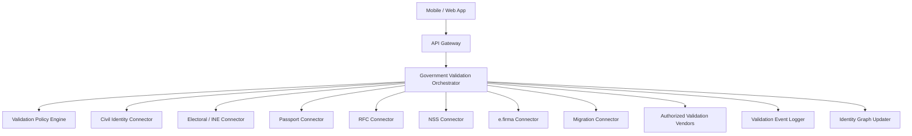

# GOVERNMENT_VALIDATION_PLAN.md

# Universal ID MX — Government Validation Plan

> Purpose: Define how Universal ID MX should validate identity data against government-backed sources in Mexico, how that validation should be structured technically and operationally, and how to expand the model internationally later.

---

## 1. Goal

The goal of the government validation layer is to ensure that the Universal ID is not just self-asserted.

It must be backed by verifiable validation against official records, official documents, and authorized trust sources whenever possible.

The system should answer questions like:

- Is this person real?
- Does this official identifier belong to this person?
- Does this document match the person?
- Is this record still current?
- Which fields are government-validated versus only user-provided?
- How fresh is the validation?

---

## 2. Strategic principle

Universal ID MX should be built around **government-backed validation**, but with a realistic implementation approach.

That means:

1. use direct government integrations where legally and technically possible
2. use authorized intermediaries or validation vendors where direct access is not possible
3. use document authenticity + biometric correlation where no live government API exists
4. record field-level trust status instead of pretending all data has equal certainty
5. keep the architecture modular by validation domain

---

## 3. Validation domains in Mexico

The validation program should be divided into domains.

## 3.1 Civil identity domain
Core identity of the person.

### Data to validate
- full legal name
- date of birth
- place of birth
- nationality
- sex marker where relevant
- CURP
- birth certificate linkage

## 3.2 Electoral identity domain
Identity information tied to voter credentials.

### Data to validate
- INE credential authenticity
- identity fields extracted from INE
- name / DOB / face correlation
- credential status where lawfully possible

## 3.3 Travel identity domain
Passport-based identity.

### Data to validate
- passport authenticity
- passport number
- expiration
- document-person match

## 3.4 Fiscal identity domain
Tax identity.

### Data to validate
- RFC linkage
- person-to-RFC consistency
- tax identity metadata if available to authorized flows

## 3.5 Social security domain
Labor and social security identity.

### Data to validate
- NSS linkage
- person-to-NSS consistency
- social security ownership where legally supportable

## 3.6 Digital signature domain
High-assurance digital identity.

### Data to validate
- e.firma certificate validity
- person-to-certificate linkage
- certificate state
- high-assurance signing factor

## 3.7 Migration / resident identity domain
For foreigners or cross-status users.

### Data to validate
- residence document authenticity
- passport linkage
- immigration status evidence where legally supportable

---

## 4. Validation maturity levels

The platform should classify validation methods by strength.

## Level 0 — Self-claimed
The user entered the data. No trusted validation.

## Level 1 — Document observed
A document was captured and OCR extracted the data, but no deeper authenticity or government confirmation yet.

## Level 2 — Document verified + biometric corroboration
The document passed authenticity checks and the person matched it biometrically.

## Level 3 — Government-backed field validation
Specific fields were validated against a government-backed system or authorized official source.

## Level 4 — High-assurance government-linked identity
Multiple key identifiers and/or digital signature elements were validated, and strong authentication or certificate evidence is present.

---

## 5. Validation method hierarchy

For each field, trust should be assigned using this priority order:

1. direct government validation
2. official digital certificate / e.firma validation
3. authorized government-adjacent source with legal standing
4. verified official document + biometric match
5. multi-source corroboration
6. self-claimed data

This hierarchy must be reflected in the graph and the UI.

---

## 6. What should be validated first

The Mexico MVP should focus on the smallest set of validations that gives the strongest practical identity foundation.

## Priority 1
- CURP
- birth certificate-linked civil identity
- INE document authenticity and field extraction
- selfie + liveness + face match
- passport document support
- RFC linkage

## Priority 2
- NSS linkage
- driver’s license support
- e.firma support
- stronger document status validations

## Priority 3
- migration / resident identity
- health / education-linked identity extensions
- signature workflows
- institution-issued verified credentials

---

## 7. Government validation architecture

## 7.1 Core components



## 7.2 Core principle
The orchestration layer should hide whether a validation came from:
- a direct government API
- a partner integration
- a licensed or authorized provider
- a document-based corroboration flow

The rest of the product should consume one normalized validation result.

---

## 8. Validation connector model

Each domain should be implemented through a connector pattern.

```ts
export interface GovernmentValidationConnector {
  name: string;
  domain: string;
  countryCode: string;
  supports(input: ValidationRequest): boolean;
  validate(input: ValidationRequest): Promise<ValidationResult>;
  healthCheck(): Promise<boolean>;
}
```

## 8.1 Validation request example

```ts
type ValidationRequest = {
  profileId: string;
  domain: "CURP" | "BIRTH_CERTIFICATE" | "INE" | "PASSPORT" | "RFC" | "NSS" | "EFIRMA";
  claimedData: Record<string, unknown>;
  linkedDocuments?: Array<{
    documentType: string;
    fileRef: string;
  }>;
  biometricEvidence?: {
    selfieRef?: string;
    livenessRef?: string;
  };
};
```

## 8.2 Validation result example

```ts
type ValidationResult = {
  domain: string;
  overallResult: "verified" | "partial_match" | "pending_review" | "rejected" | "unavailable";
  fieldResults: Array<{
    field: string;
    result: "verified" | "mismatch" | "not_found" | "not_checked";
    confidence: "low" | "medium" | "high";
  }>;
  sourceType: "direct_government" | "authorized_partner" | "document_plus_biometrics";
  sourceName: string;
  evidenceRefs: string[];
  validatedAt: string;
  expiresAt?: string;
};
```

---

## 9. Domain-specific plan

## 9.1 CURP validation plan

### Objective
Confirm that the claimed CURP belongs to the person and that core civil identity fields match.

### Inputs
- full name
- date of birth
- sex marker if relevant
- state / place of birth where applicable
- claimed CURP

### Validation outputs
- CURP valid / invalid
- full-name match
- DOB match
- place-of-birth consistency if supported
- field-level mismatch flags

### Implementation stages
#### Stage A
Basic syntax and deterministic consistency checks.

#### Stage B
Correlate CURP with captured document data and profile data.

#### Stage C
Validate against a government-backed or authorized official source.

### Notes
CURP should become one of the strongest linking keys in the graph, but not the only one.

---

## 9.2 Birth certificate validation plan

### Objective
Validate foundational civil identity at the source-of-origin level.

### Inputs
- name
- DOB
- place of birth
- acta details where available
- linked civil document evidence

### Validation outputs
- birth record found / not found
- foundational fields matched / mismatched
- confidence that the civil identity exists as claimed

### Why it matters
This is one of the strongest anchors for identity creation in Mexico.

---

## 9.3 INE validation plan

### Objective
Use the voter credential as a high-trust identity document while respecting legal and access limitations.

### Inputs
- front/back document images
- OCR-extracted fields
- selfie
- liveness evidence

### Validation outputs
- document authenticity confidence
- extracted field confidence
- face-to-document match result
- identity consistency result
- credential freshness / expiration where supportable
- status confirmation if legally available through allowed pathways

### Implementation stages
#### Stage A
Document capture + OCR + security feature analysis.

#### Stage B
Selfie + liveness + face match.

#### Stage C
Any lawful status or field corroboration available through authorized channels.

### Notes
Even where live status checks are limited, INE can still be a major trust document when combined with biometrics and other validations.

---

## 9.4 Passport validation plan

### Objective
Use passport as a travel-grade identity document.

### Inputs
- passport image
- OCR extraction
- selfie
- liveness

### Validation outputs
- authenticity confidence
- field consistency
- expiration
- face match result

### Implementation stages
- document authenticity
- biometric corroboration
- official or partner validation where available

---

## 9.5 RFC validation plan

### Objective
Link tax identity to the master profile.

### Inputs
- claimed RFC
- canonical identity data
- document evidence where needed

### Validation outputs
- RFC format valid
- RFC-person consistency
- government-backed confirmation if available to the model
- tax identity linkage confidence

### Why it matters
RFC is critical for finance, invoicing, employment, and formal identity reuse.

---

## 9.6 NSS validation plan

### Objective
Link social security identity to the person.

### Inputs
- claimed NSS
- canonical identity data
- supporting evidence

### Validation outputs
- NSS format / structural validity
- person-to-NSS consistency
- official linkage confidence

### Notes
This may require stronger legal and operational pathways and may come after the first MVP.

---

## 9.7 e.firma validation plan

### Objective
Add a high-assurance digital identity factor.

### Inputs
- certificate or signing interaction
- canonical profile
- certificate metadata

### Validation outputs
- certificate valid / invalid
- owner identity match
- certificate active / expired / revoked
- assurance level uplift

### Why it matters
e.firma can become the strongest digital proof path in later phases.

---

## 10. Cross-domain orchestration logic

The system should not validate identifiers in isolation.

Example:

1. Validate CURP
2. Compare CURP-derived person data with:
   - INE extracted fields
   - passport extracted fields
   - RFC pattern consistency
   - birth certificate data
3. Use biometrics to confirm user-document ownership
4. Update canonical profile only through recorded validation events

This multi-domain correlation is what makes the Universal ID stronger than a document upload app.

---

## 11. Validation policies

Each validation domain should have configurable policy requirements.

## Example: onboarding policy
- require INE or passport
- require selfie and liveness
- require CURP validation
- require one successful high-confidence field match across name + DOB
- mark profile as `partially_validated` if only document + biometrics passed
- mark profile as `validated` only after at least one government-backed field validation

## Example: high-assurance policy
- require two government-backed identifiers
- require biometric pass
- require passkey enrollment
- optionally require e.firma support

---

## 12. Field-level validation model

Validation should be stored per field, not only as one big pass/fail.

### Example

```json
{
  "domain": "CURP",
  "overallResult": "partial_match",
  "fieldResults": [
    {"field": "full_name", "result": "verified", "confidence": "high"},
    {"field": "date_of_birth", "result": "verified", "confidence": "high"},
    {"field": "curp", "result": "verified", "confidence": "high"},
    {"field": "place_of_birth", "result": "mismatch", "confidence": "medium"}
  ]
}
```

This prevents the graph from over-trusting the whole record when only some parts match.

---

## 13. Freshness and revalidation

Government-backed validation should not always be treated as permanent.

## 13.1 Revalidation triggers
- document expiration reached
- risky account recovery
- suspicious device change
- credential presentation for high-risk action
- institution-specific assurance requirement
- major profile update
- stale validation age threshold reached

## 13.2 Suggested freshness policy examples
- selfie liveness: short-lived confidence
- document validity: until document expiry or earlier if risk event occurs
- CURP / birth identity: longer-lived
- e.firma certificate: must check current certificate status
- high-risk account recovery: fresh biometric required

---

## 14. Exception handling

Not every user will validate cleanly.

## 14.1 Common exception cases
- name mismatch due to formatting
- missing maternal surname
- inconsistent DOB across documents
- duplicate CURP usage
- damaged document
- expired document
- no available digital record pathway
- foreign resident with incomplete local records
- OCR uncertainty

## 14.2 Resolution paths
- request another document
- ask user to confirm identity data
- send to manual review
- request assisted onboarding
- restrict profile until resolved
- downgrade assurance temporarily

---

## 15. Manual review workflow

Human review must exist from day one.

## Review scenarios
- strong conflict between two official identifiers
- suspicious re-enrollment
- duplicate person graph candidate
- biometric borderline case
- document authenticity uncertain
- government response ambiguous

## Reviewer capabilities
- inspect evidence
- compare extracted fields
- compare validation attempts
- approve / reject field linkage
- override with justification
- trigger re-check
- flag fraud

Every reviewer action must create an audit event.

---

## 16. Security requirements for validation layer

## 16.1 Technical requirements
- encrypt all requests and evidence
- store hashes of sensitive request / response payloads
- minimize raw payload retention
- strict service-to-service auth
- isolate validation connectors
- redact logs
- short-lived access to raw evidence
- signed event logging

## 16.2 Operational requirements
- vendor due diligence
- connector access inventory
- legal basis inventory by domain
- incident runbooks for leaked identity data
- internal least-privilege access
- periodic connector permission review

---

## 17. Compliance workstream attached to validation

This plan requires a dedicated legal / compliance lane.

### It should define
- legal basis for each validation domain
- whether direct or indirect access is permissible
- required user consent wording
- retention periods by artifact type
- biometric processing disclosures
- cross-border transfer limits for vendors
- institution-specific obligations
- breach response requirements

Engineering should not guess these rules.
Engineering should build for configurable policy enforcement.

---

## 18. Suggested implementation sequence

## Phase 0 — Planning
- map all target validation domains
- legal review of access models
- shortlist connectors and vendors
- define field-level trust model
- define graph update rules

## Phase 1 — Practical trust base
- document capture
- OCR
- liveness
- face match
- CURP flow
- INE support
- passport support
- event logging
- manual review queue

## Phase 2 — Stronger government linkage
- birth certificate validation
- RFC linkage
- profile canonicalization improvements
- duplicate detection

## Phase 3 — Higher assurance
- NSS linkage
- e.firma integration
- advanced recovery
- institutional trust policies

## Phase 4 — Expansion
- foreign resident support
- cross-border identity mapping
- country adapter framework
- second-country validation rollout

---

## 19. Global expansion model

Once Mexico is mature, the same architecture can be reused internationally.

## Country abstraction
Every country should define:
- identity domains
- official identifiers
- document types
- validation sources
- legal constraints
- trust scoring rules
- freshness rules

## Example interface

```ts
type CountryValidationProfile = {
  countryCode: string;
  supportedDomains: string[];
  identifierTypes: string[];
  validationMethods: string[];
  minimumAssurancePolicies: string[];
};
```

Mexico is simply the first country profile.

---

## 20. Success metrics

The validation layer should be measured by:

- percentage of profiles reaching validated status
- field match rate by domain
- false accept rate
- false reject rate
- manual review rate
- review resolution time
- duplicate detection rate
- fraud catch rate
- revalidation success rate
- institution acceptance rate

---

## 21. Final rule

The government validation layer should never pretend certainty it does not have.

Every result should clearly distinguish:

- self-claimed
- document-observed
- document-verified
- government-validated
- high-assurance government-linked

That distinction is what makes Universal ID MX trustworthy.

---

## 22. Recommended next implementation files

Create these next:

1. `VALIDATION_CONNECTOR_INTERFACE.md`
2. `FIELD_LEVEL_TRUST_MODEL.md`
3. `MANUAL_REVIEW_PLAYBOOK.md`
4. `MEXICO_VALIDATION_DOMAINS_MATRIX.md`
5. `REVALIDATION_AND_FRESHNESS_RULES.md`

---
