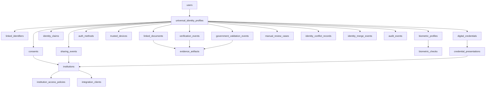

# IDENTITY_GRAPH_SCHEMA.md

# Universal ID MX — Identity Graph Schema

> Purpose: Define the canonical identity graph for a Mexico-first universal identity platform with government validation at the center.

---

## 1. Overview

The identity graph is the **core data model** of Universal ID MX.

Its job is to represent one real-world person as one **canonical universal identity**, while linking all known identifiers, documents, claims, credentials, validations, devices, and permissions that belong to that person.

This graph must solve five problems:

1. **Identity consolidation** — unify fragmented records into one profile
2. **Identity resolution** — determine whether two records belong to the same person
3. **Trust scoring** — distinguish claimed data from validated data
4. **Auditability** — preserve the history of how each claim became trusted
5. **Portability** — allow the identity to be reused across institutions

---

## 2. Graph design principles

### 2.1 Canonical-person model
Every person should map to exactly one active `universal_identity_profile` in normal conditions.

### 2.2 Multi-source truth
Not all sources are equally trusted. The graph must support multiple values, conflicting values, and evidence history.

### 2.3 Claim-first architecture
The platform should not only store documents. It should store **claims**, their sources, their trust status, and their verification history.

### 2.4 Evidence preservation
Any high-trust claim should be traceable to the evidence and validation event that supports it.

### 2.5 Conflict tolerance
The graph must support:
- unresolved conflicts
- pending review
- soft-linked records
- rejected links
- merged duplicate profiles

### 2.6 Country extensibility
Mexico-specific fields should exist, but the graph must be extensible to future countries.

---

## 3. Main graph entities

The identity graph is composed of the following primary node families:

### 3.1 Person / Identity nodes
- `users`
- `universal_identity_profiles`

### 3.2 Identifier nodes
- `linked_identifiers`

### 3.3 Document nodes
- `linked_documents`

### 3.4 Claim nodes
- `identity_claims`

### 3.5 Validation / evidence nodes
- `verification_events`
- `government_validation_events`
- `evidence_artifacts`

### 3.6 Biometric nodes
- `biometric_profiles`
- `biometric_checks`

### 3.7 Authentication nodes
- `auth_methods`
- `trusted_devices`
- `sessions`
- `recovery_events`

### 3.8 Credential / sharing nodes
- `digital_credentials`
- `credential_presentations`
- `consents`
- `sharing_events`

### 3.9 Institutional / trust nodes
- `institutions`
- `institution_access_policies`
- `integration_clients`

### 3.10 Governance nodes
- `audit_events`
- `manual_review_cases`
- `identity_merge_events`
- `identity_conflict_records`

---

## 4. Core graph relationships

Below is the conceptual relationship map.



---

## 5. Canonical identity model

## 5.1 Core idea

A single user may have multiple identity sources:

- user-entered profile data
- OCR-extracted document data
- biometric results
- government validation responses
- linked identifiers like CURP, RFC, NSS
- institutional credentials later

The graph must produce one **canonical identity profile** from all of this.

## 5.2 Canonical fields

At minimum, the canonical profile should maintain:

- full legal name
- date of birth
- place of birth
- nationality
- sex / gender marker where legally relevant
- canonical CURP
- primary RFC
- primary NSS
- preferred display name
- highest assurance level
- identity status
- graph confidence score
- last government validation timestamp

---

## 6. Entity definitions

## 6.1 `users`

Represents the application account holder.

### Purpose
Application-level account and contact layer.

### Fields
- `id`
- `email`
- `phone`
- `status`
- `email_verified_at`
- `phone_verified_at`
- `created_at`
- `updated_at`

### Notes
A `user` is not the same as a validated identity.
A user may begin with a low-trust account and later create a validated universal identity profile.

---

## 6.2 `universal_identity_profiles`

Represents the master identity node.

### Purpose
The canonical person-level profile.

### Required fields
- `id`
- `user_id`
- `country_code`
- `canonical_full_name`
- `canonical_given_names`
- `canonical_paternal_surname`
- `canonical_maternal_surname`
- `canonical_date_of_birth`
- `canonical_place_of_birth`
- `canonical_nationality`
- `canonical_sex_marker`
- `primary_curp`
- `primary_rfc`
- `primary_nss`
- `assurance_level`
- `identity_status`
- `graph_confidence_score`
- `last_government_validated_at`
- `created_at`
- `updated_at`

### Example statuses
- `draft`
- `pending_validation`
- `partially_validated`
- `validated`
- `restricted`
- `suspended`
- `merged`
- `archived`

### Assurance examples
- `IAL0`
- `IAL1`
- `IAL2`
- `IAL3`
- `high_assurance_custom`

---

## 6.3 `linked_identifiers`

Represents a government or institutional identifier associated with the person.

### Common Mexico identifier types
- `CURP`
- `RFC`
- `NSS`
- `INE_CLAVE`
- `PASSPORT_NUMBER`
- `DRIVERS_LICENSE_NUMBER`
- `EFIRMA_CERT_ID`
- `RESIDENCE_DOC_NUMBER`

### Required fields
- `id`
- `universal_identity_profile_id`
- `identifier_type`
- `identifier_value`
- `issuing_country_code`
- `issuing_authority`
- `source_type`
- `source_reference`
- `verification_status`
- `confidence_level`
- `is_primary`
- `last_validated_at`
- `expires_at`
- `created_at`
- `updated_at`

### Source examples
- `self_claimed`
- `document_extracted`
- `government_validated`
- `institution_verified`
- `manual_review_confirmed`

### Verification statuses
- `unverified`
- `pending`
- `verified`
- `expired`
- `rejected`
- `conflicted`

---

## 6.4 `linked_documents`

Represents an identity document attached to the profile.

### Mexico-first document types
- `BIRTH_CERTIFICATE`
- `INE`
- `PASSPORT`
- `DRIVERS_LICENSE`
- `RESIDENCE_CARD`
- `MILITARY_CARD`
- `EFIRMA_CERTIFICATE_DOC`

### Required fields
- `id`
- `universal_identity_profile_id`
- `document_type`
- `document_number`
- `issuing_country_code`
- `issuing_authority`
- `document_version`
- `raw_front_storage_path`
- `raw_back_storage_path`
- `extracted_data`
- `document_hash`
- `verification_status`
- `fraud_flags`
- `expires_at`
- `created_at`
- `updated_at`

### Notes
Raw document files should be stored encrypted and retained only as long as necessary.

---

## 6.5 `identity_claims`

Represents a single claim about the person.

### Examples
- legal name
- date of birth
- CURP
- nationality
- address
- age over 18
- voter eligibility
- passport validity
- social security linkage

### Required fields
- `id`
- `universal_identity_profile_id`
- `claim_namespace`
- `claim_key`
- `claim_value`
- `value_type`
- `source_type`
- `source_reference`
- `claim_status`
- `confidence_level`
- `is_canonical`
- `valid_from`
- `valid_until`
- `validated_at`
- `created_at`
- `updated_at`

### Suggested namespaces
- `civil_identity`
- `government_identifier`
- `document_data`
- `biometric_status`
- `contact`
- `address`
- `tax`
- `social_security`
- `travel_identity`
- `authentication`
- `derived_attribute`

### Claim status values
- `self_claimed`
- `observed`
- `verified`
- `derived_verified`
- `expired`
- `conflicted`
- `rejected`

### Derived claims
Some claims should be derived instead of directly stored from raw docs, for example:
- age over 18
- exact match across 3 sources
- liveness completed
- account recovery eligible

---

## 6.6 `verification_events`

Represents any verification action performed on the profile.

### Required fields
- `id`
- `universal_identity_profile_id`
- `verification_type`
- `source_system`
- `initiated_by_type`
- `initiated_by_id`
- `result`
- `confidence_outcome`
- `risk_score`
- `event_payload`
- `occurred_at`
- `created_at`

### Examples
- document OCR completed
- face match passed
- duplicate detected
- manual review approved
- RFC linked
- profile promoted to higher assurance

---

## 6.7 `government_validation_events`

Represents a validation performed specifically against government-backed sources or authorized public-trust sources.

### Required fields
- `id`
- `universal_identity_profile_id`
- `validation_domain`
- `government_system_name`
- `government_system_reference`
- `request_payload_hash`
- `response_payload_hash`
- `validated_fields`
- `validation_result`
- `field_level_results`
- `validated_at`
- `expires_at`
- `created_at`

### Validation domains
- `CURP`
- `BIRTH_CERTIFICATE`
- `INE`
- `PASSPORT`
- `RFC`
- `NSS`
- `EFIRMA`
- `MIGRATION_STATUS`

---

## 6.8 `evidence_artifacts`

Represents evidence that supports a claim or validation.

### Examples
- document image
- selfie image
- liveness video
- OCR extraction JSON
- government response proof hash
- signed receipt
- reviewer notes
- match report

### Required fields
- `id`
- `artifact_type`
- `storage_path`
- `content_hash`
- `mime_type`
- `encryption_key_reference`
- `retention_policy_key`
- `created_at`

---

## 6.9 `biometric_profiles`

Represents the long-term biometric trust state of a profile.

### Required fields
- `id`
- `universal_identity_profile_id`
- `biometric_status`
- `face_template_reference`
- `last_strong_match_at`
- `spoof_risk_level`
- `created_at`
- `updated_at`

### Notes
Avoid storing raw biometric data unless absolutely necessary.
Prefer secure templates or vendor references.

---

## 6.10 `biometric_checks`

Represents a single biometric check event.

### Required fields
- `id`
- `universal_identity_profile_id`
- `check_type`
- `vendor_name`
- `liveness_result`
- `face_match_score`
- `spoof_signals`
- `result`
- `evidence_artifact_id`
- `created_at`

---

## 6.11 `auth_methods`

Represents authentication mechanisms attached to the profile.

### Types
- `PASSWORD`
- `PASSKEY`
- `EMAIL_OTP`
- `SMS_OTP`
- `TOTP`
- `STRONG_BIOMETRIC_UNLOCK`

### Required fields
- `id`
- `universal_identity_profile_id`
- `method_type`
- `method_reference`
- `status`
- `assurance_contribution`
- `created_at`
- `updated_at`

---

## 6.12 `trusted_devices`

Represents devices bound to the identity.

### Required fields
- `id`
- `universal_identity_profile_id`
- `device_fingerprint_hash`
- `platform`
- `device_name`
- `attestation_level`
- `status`
- `last_seen_at`
- `created_at`

---

## 6.13 `digital_credentials`

Represents a reusable digital credential issued to the user.

### Examples
- verified identity credential
- verified age credential
- verified CURP linkage credential
- verified tax identity credential
- verified social security linkage credential

### Required fields
- `id`
- `universal_identity_profile_id`
- `credential_type`
- `issuer`
- `format`
- `credential_payload`
- `status`
- `issued_at`
- `expires_at`
- `revoked_at`

---

## 6.14 `credential_presentations`

Represents the act of presenting claims or credentials to an institution.

### Required fields
- `id`
- `digital_credential_id`
- `institution_id`
- `requested_claims`
- `shared_claims`
- `presentation_status`
- `presented_at`

---

## 6.15 `consents`

Represents permissions granted by the user.

### Required fields
- `id`
- `universal_identity_profile_id`
- `institution_id`
- `purpose`
- `approved_claims`
- `consent_status`
- `granted_at`
- `revoked_at`

---

## 6.16 `sharing_events`

Represents a concrete act of sharing identity data.

### Required fields
- `id`
- `universal_identity_profile_id`
- `institution_id`
- `sharing_type`
- `claims_shared`
- `credential_ids_shared`
- `consent_id`
- `created_at`

---

## 6.17 `institutions`

Represents organizations that rely on or validate the identity.

### Examples
- bank
- government service
- hospital
- university
- employer
- insurer
- telco

### Required fields
- `id`
- `name`
- `institution_type`
- `country_code`
- `status`
- `created_at`

---

## 6.18 `institution_access_policies`

Represents what a given institution is allowed to request.

### Required fields
- `id`
- `institution_id`
- `policy_name`
- `allowed_claims`
- `allowed_assurance_levels`
- `requires_step_up_auth`
- `created_at`
- `updated_at`

---

## 6.19 `manual_review_cases`

Represents an identity case needing human decision.

### Required fields
- `id`
- `universal_identity_profile_id`
- `case_type`
- `case_reason`
- `status`
- `assigned_to`
- `resolution`
- `created_at`
- `resolved_at`

---

## 6.20 `identity_conflict_records`

Represents conflicting identity signals.

### Examples
- DOB mismatch between INE and passport
- RFC does not match name pattern
- duplicate CURP found in two profiles

### Required fields
- `id`
- `universal_identity_profile_id`
- `conflict_type`
- `field_name`
- `observed_values`
- `severity`
- `status`
- `created_at`
- `resolved_at`

---

## 6.21 `identity_merge_events`

Represents the merge of duplicate profiles.

### Required fields
- `id`
- `source_profile_id`
- `target_profile_id`
- `merge_reason`
- `merge_strategy`
- `approved_by`
- `created_at`

---

## 6.22 `audit_events`

Represents immutable system-level audit history.

### Required fields
- `id`
- `actor_type`
- `actor_id`
- `entity_type`
- `entity_id`
- `event_type`
- `event_payload`
- `ip_hash`
- `device_context`
- `created_at`

---

## 7. Mexico-first canonical claim set

The following claims should be first-class in Mexico.

## 7.1 Civil identity
- full legal name
- given names
- paternal surname
- maternal surname
- DOB
- place of birth
- nationality
- sex marker

## 7.2 Government identifiers
- CURP
- RFC
- NSS

## 7.3 Government documents
- INE number and status fields where lawfully supported
- passport number and expiration
- driver’s license number and expiration
- residence document number and expiration
- e.firma certificate reference

## 7.4 Contact / recovery
- verified email
- verified phone
- verified device
- passkey registered

## 7.5 Derived trust claims
- government validated identity
- liveness passed
- face match passed
- age over threshold
- strong recovery enrolled
- high assurance profile

---

## 8. Identity resolution rules

The graph must determine whether multiple inputs refer to the same person.

## 8.1 Strong match signals
- exact CURP match
- exact RFC match with matching name / DOB context
- exact NSS match with strong corroboration
- e.firma linkage
- government validation confirmation
- high-confidence biometric match combined with document linkage

## 8.2 Medium match signals
- full name + DOB + document match
- passport + face match + phone continuity
- INE + selfie + address overlap

## 8.3 Weak match signals
- name similarity only
- phone only
- email only

## 8.4 Conflict triggers
- one identifier linked to multiple active profiles
- document data inconsistent with validated claims
- biometric mismatch
- suspicious re-enrollment attempt

---

## 9. Canonicalization rules

When multiple values exist, the graph must choose a canonical value.

## Priority order example
1. government-validated value
2. manually reviewed confirmed value
3. multi-source exact match value
4. document-extracted value from high-trust doc
5. self-claimed value

Every canonical value should still preserve the non-canonical historical variants.

---

## 10. Normalization rules

Normalize all identity data before matching.

### Examples
- uppercase names
- strip accents for search index, but preserve original value
- normalize whitespace
- split paternal / maternal surnames carefully
- standardize date format
- standardize identifier formatting
- hash search keys for privacy-sensitive indexes where appropriate

---

## 11. Suggested relational schema starter

```sql
create table users (
  id uuid primary key,
  email text unique,
  phone text unique,
  status text not null,
  email_verified_at timestamptz,
  phone_verified_at timestamptz,
  created_at timestamptz not null default now(),
  updated_at timestamptz not null default now()
);

create table universal_identity_profiles (
  id uuid primary key,
  user_id uuid not null unique references users(id),
  country_code text not null,
  canonical_full_name text,
  canonical_given_names text,
  canonical_paternal_surname text,
  canonical_maternal_surname text,
  canonical_date_of_birth date,
  canonical_place_of_birth text,
  canonical_nationality text,
  canonical_sex_marker text,
  primary_curp text,
  primary_rfc text,
  primary_nss text,
  assurance_level text not null default 'IAL0',
  identity_status text not null default 'draft',
  graph_confidence_score numeric(5,4),
  last_government_validated_at timestamptz,
  created_at timestamptz not null default now(),
  updated_at timestamptz not null default now()
);

create table linked_identifiers (
  id uuid primary key,
  universal_identity_profile_id uuid not null references universal_identity_profiles(id),
  identifier_type text not null,
  identifier_value text not null,
  issuing_country_code text not null,
  issuing_authority text,
  source_type text not null,
  source_reference text,
  verification_status text not null,
  confidence_level text not null,
  is_primary boolean not null default false,
  last_validated_at timestamptz,
  expires_at timestamptz,
  created_at timestamptz not null default now(),
  updated_at timestamptz not null default now()
);

create unique index linked_identifiers_unique_active
on linked_identifiers(identifier_type, identifier_value, universal_identity_profile_id);

create table linked_documents (
  id uuid primary key,
  universal_identity_profile_id uuid not null references universal_identity_profiles(id),
  document_type text not null,
  document_number text,
  issuing_country_code text not null,
  issuing_authority text,
  document_version text,
  raw_front_storage_path text,
  raw_back_storage_path text,
  extracted_data jsonb not null default '{}',
  document_hash text,
  verification_status text not null,
  fraud_flags jsonb not null default '[]',
  expires_at timestamptz,
  created_at timestamptz not null default now(),
  updated_at timestamptz not null default now()
);

create table identity_claims (
  id uuid primary key,
  universal_identity_profile_id uuid not null references universal_identity_profiles(id),
  claim_namespace text not null,
  claim_key text not null,
  claim_value jsonb not null,
  value_type text not null,
  source_type text not null,
  source_reference text,
  claim_status text not null,
  confidence_level text not null,
  is_canonical boolean not null default false,
  valid_from timestamptz,
  valid_until timestamptz,
  validated_at timestamptz,
  created_at timestamptz not null default now(),
  updated_at timestamptz not null default now()
);

create table verification_events (
  id uuid primary key,
  universal_identity_profile_id uuid not null references universal_identity_profiles(id),
  verification_type text not null,
  source_system text not null,
  initiated_by_type text not null,
  initiated_by_id uuid,
  result text not null,
  confidence_outcome text,
  risk_score numeric(6,4),
  event_payload jsonb not null default '{}',
  occurred_at timestamptz not null,
  created_at timestamptz not null default now()
);

create table government_validation_events (
  id uuid primary key,
  universal_identity_profile_id uuid not null references universal_identity_profiles(id),
  validation_domain text not null,
  government_system_name text not null,
  government_system_reference text,
  request_payload_hash text,
  response_payload_hash text,
  validated_fields jsonb not null default '[]',
  validation_result text not null,
  field_level_results jsonb not null default '{}',
  validated_at timestamptz not null,
  expires_at timestamptz,
  created_at timestamptz not null default now()
);
```

---

## 12. Example profile graph

A validated Mexico user might look like this conceptually:

```json
{
  "universal_identity_profile": {
    "id": "uip_123",
    "canonical_full_name": "JUAN PEREZ LOPEZ",
    "canonical_date_of_birth": "1995-07-12",
    "primary_curp": "PELJ950712HDFXXX01",
    "primary_rfc": "PELJ950712ABC",
    "primary_nss": "12345678901",
    "assurance_level": "IAL2",
    "identity_status": "validated"
  },
  "linked_identifiers": [
    {"type": "CURP", "status": "verified", "source": "government_validated"},
    {"type": "RFC", "status": "verified", "source": "government_validated"},
    {"type": "NSS", "status": "verified", "source": "government_validated"},
    {"type": "PASSPORT_NUMBER", "status": "verified", "source": "document_extracted"}
  ],
  "claims": [
    {"key": "full_name", "status": "verified", "is_canonical": true},
    {"key": "date_of_birth", "status": "verified", "is_canonical": true},
    {"key": "age_over_18", "status": "derived_verified", "is_canonical": true}
  ],
  "biometric_status": {
    "liveness_passed": true,
    "face_match_score": 0.98
  }
}
```

---

## 13. Operational rules

### 13.1 Never hard-delete critical audit data
Identity history must remain reconstructable.

### 13.2 Keep raw evidence separate from reusable claims
Claims should be portable. Raw evidence should be tightly controlled.

### 13.3 One field may have multiple competing claims
Do not overwrite history blindly.

### 13.4 Canonical does not mean only
Canonical means “currently trusted best value,” not “only stored value.”

### 13.5 Government validation should update claims through events
Never directly mutate trusted claims without an event trail.

---

## 14. Recommended next implementation files

Create these after this schema:

1. `IDENTITY_RESOLUTION_RULES.md`
2. `CANONICALIZATION_ENGINE_SPEC.md`
3. `DATA_RETENTION_AND_DELETION.md`
4. `CLAIMS_TAXONOMY_MX.md`
5. `EVENT_MODEL_AND_AUDIT_LOG.md`

---
