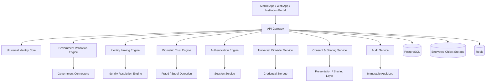
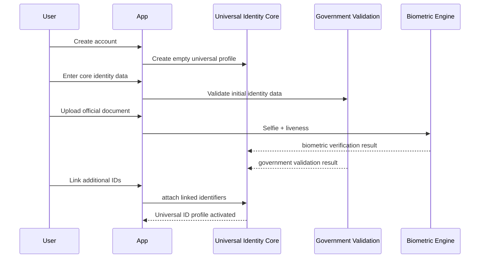

# Universal ID MX — Foundational Product Blueprint

> Working name: **Universal ID MX**  
> Vision: Create **one universal digital identity** that a person can use across all major life domains, with **government validation at the core**.

---

## 1. Core vision

Universal ID MX is not just a verification layer.

It is a **single universal identity system** that aims to unify the different identity records a person already has into **one master digital identity**, validated against government sources and usable across:

- government services
- finance
- healthcare
- education
- employment
- travel
- telecom
- insurance
- legal / signature flows
- everyday private-sector onboarding

### The end-state vision

A user should be able to say:

> “This is my one official digital identity, backed by government validation, and I can use it everywhere.”

---

## 2. Product definition

Universal ID MX should function as a **master identity account** that connects, validates, and manages all core identity records belonging to one person.

It should:

1. identify the person uniquely
2. validate the person against government records
3. connect the person’s existing IDs and records
4. let the person prove identity digitally
5. let institutions trust one identity profile instead of asking for repeated documents
6. become the user’s default digital identity for all important interactions

---

## 3. Product objective

The objective is to create a **single digital identity profile** that consolidates the main IDs and identity-linked records a person in Mexico commonly has.

This universal ID should unify:

- who the person is
- what government records confirm that identity
- which official identifiers belong to that person
- which credentials can be reused digitally
- which institutions can trust that identity

---

## 4. Main concept

## 4.1 Universal identity graph

The core of the system is a **master identity graph**.

Each user has one **Universal ID profile**.
That profile links all relevant identity sources and records into one canonical identity.

### Example

A single person may have:

- CURP
- RFC
- NSS
- birth certificate
- INE
- passport
- driver’s license
- e.firma
- phone number
- email
- address history
- biometric profile
- healthcare or institutional records later

The app should unify all of these into one identity account.

---

## 5. What a regular Mexican may need to unify

## 5.1 Foundational civil identity
- CURP
- Acta de nacimiento
- name
- date of birth
- place of birth
- sex / gender marker where applicable
- nationality

## 5.2 Electoral / civic identity
- INE credential
- voter key / related identity fields where available through lawful integration

## 5.3 Travel identity
- passport
- passport number
- issuance and expiration metadata

## 5.4 Fiscal identity
- RFC
- tax status metadata if integration later allows it

## 5.5 Social security / labor identity
- NSS
- social security affiliation linkage
- employment-linked verified records later

## 5.6 Driving / mobility identity
- driver’s license
- state-specific mobility credential
- vehicle-linked user identity later if desired

## 5.7 Digital signature / strong digital identity
- e.firma
- certificate status
- signing capability
- high-assurance authentication level

## 5.8 Foreign resident / migration identity
- residence card / immigration document
- passport linkage for foreigners living in Mexico

## 5.9 Supporting identity factors
- verified phone number
- verified email
- verified address
- selfie
- liveness result
- face match result
- trusted device bindings
- passkeys

---

## 6. Product positioning

This product should be positioned as:

- a **universal digital identity**
- a **single official-backed identity profile**
- a **government-validated digital ID**
- a **digital identity wallet and trust account**
- a **portable identity for every major service**

Do **not** position it as just:
- KYC software
- identity verification API only
- B2B-only infrastructure
- login tool only

Those can be part of the product, but not the product definition.

---

## 7. Product thesis

The thesis is:

People already have many identity fragments.

Universal ID MX turns those fragments into **one canonical digital identity**.

Instead of showing different IDs everywhere, the user uses one digital ID account that is backed by government validation and linked to all the official records that matter.

---

## 8. Target end state

A user should be able to:

- create one Universal ID account
- validate it against government data
- link all major official IDs
- store proof of those linked records
- share only what is needed
- sign in anywhere with the same identity
- recover access safely
- use the same identity in Mexico and later abroad

---

## 9. Product pillars

## 9.1 Government validation
The system must validate identity against government-backed data whenever possible.

## 9.2 Unified identity profile
All major IDs should map into one master profile.

## 9.3 Reusability
The user should not need to repeat onboarding over and over.

## 9.4 Security
This system must be built like high-risk identity infrastructure.

## 9.5 Portability
The identity should work across institutions and, later, across countries.

## 9.6 User control
The user should control what is shared and when.

---

## 10. Main product modules

## 10.1 Universal Identity Core

This is the main engine that creates the master profile.

### Responsibilities
- create canonical identity record
- merge and reconcile identity data from multiple sources
- detect conflicts
- assign identity assurance score
- maintain identity history
- track linked IDs
- manage verified claims

### Output
A single master user identity.

---

## 10.2 Government Validation Engine

This module validates the user’s identity against official sources and official documents.

### Responsibilities
- validate core identity data
- validate linked official identifiers
- validate documents
- keep evidence of validation
- track freshness of validation
- distinguish self-claimed vs government-validated data

### Validation examples
- CURP match
- acta de nacimiento verification
- INE data verification
- passport verification
- RFC linkage
- NSS linkage
- e.firma certificate validation

---

## 10.3 Identity Linking Module

This module connects all identity artifacts to the master profile.

### It should link
- CURP
- RFC
- NSS
- INE
- passport
- driver’s license
- e.firma
- residence document
- future education and health credentials

### Features
- record-level linkage
- duplicate prevention
- conflict detection
- source confidence score
- human review when data conflicts

---

## 10.4 Biometric Trust Module

The system needs biometrics because one universal ID must prove the user is the real owner.

### Features
- selfie capture
- liveness detection
- face match against documents
- biometric re-verification
- account recovery checks
- spoof / fraud detection

---

## 10.5 Universal ID Wallet

The user needs an app experience where the identity actually lives.

### Wallet functions
- view Universal ID profile
- view linked IDs
- see verification status of each record
- store digital credentials
- present identity proof
- share selected fields
- manage permissions
- manage devices
- manage recovery settings

---

## 10.6 Authentication Layer

One universal ID should also become one universal login.

### Features
- passkeys
- biometric unlock
- email OTP
- SMS OTP
- TOTP
- device trust
- step-up verification
- strong recovery flow
- session history

---

## 10.7 Consent & Sharing Layer

The user should not share the entire identity every time.

### Features
- selective field sharing
- one-time consent
- reusable permissions
- revocation
- sharing history
- institution-specific access control

---

## 10.8 Institutional Trust Layer

This makes institutions able to trust the identity.

### Supported use cases
- onboarding
- login
- age verification
- KYC
- employee identity
- student identity
- health intake
- insurance verification
- travel check-in
- digital signatures
- contract signing

---

## 11. What the system must do technically

## 11.1 Master identity record

The platform must maintain one canonical record per person.

That canonical record should include:

- internal universal_id
- core civil identity
- linked official identifiers
- linked documents
- biometrics state
- validation evidence
- assurance score
- sharing permissions
- authentication methods
- audit trail

---

## 11.2 Identity confidence model

Not all data has equal trust.

Each field should carry metadata such as:

- source
- validation status
- confidence level
- last checked date
- expiration date if relevant
- verification method
- reviewer state if manually reviewed

Example:

```json
{
  "field": "rfc",
  "value": "XXXX010101XXX",
  "source": "government_validation",
  "status": "verified",
  "confidence": "high",
  "last_validated_at": "2026-04-08T00:00:00Z"
}
```

---

## 12. Mexico-first data model

## 12.1 Main entities
- users
- universal_id_profiles
- identity_claims
- linked_identifiers
- linked_documents
- verification_events
- biometric_checks
- auth_methods
- consents
- sharing_events
- institutions
- institution_access_policies
- audit_events
- recovery_events

## 12.2 Example structure

```sql
users (
  id uuid pk,
  email text,
  phone text,
  status text,
  created_at timestamptz
)

universal_id_profiles (
  id uuid pk,
  user_id uuid unique,
  canonical_full_name text,
  canonical_date_of_birth date,
  canonical_birth_place text,
  canonical_nationality text,
  assurance_level text,
  identity_status text,
  created_at timestamptz,
  updated_at timestamptz
)

linked_identifiers (
  id uuid pk,
  universal_id_profile_id uuid,
  identifier_type text,
  identifier_value text,
  source text,
  verification_status text,
  confidence_level text,
  last_validated_at timestamptz
)

linked_documents (
  id uuid pk,
  universal_id_profile_id uuid,
  document_type text,
  document_number text,
  issuer text,
  source text,
  verification_status text,
  extracted_data jsonb,
  created_at timestamptz
)

identity_claims (
  id uuid pk,
  universal_id_profile_id uuid,
  claim_key text,
  claim_value jsonb,
  source text,
  claim_status text,
  confidence_level text,
  validated_at timestamptz
)

verification_events (
  id uuid pk,
  universal_id_profile_id uuid,
  verification_type text,
  source_system text,
  result text,
  evidence jsonb,
  created_at timestamptz
)
```

---

## 13. Architecture direction

## 13.1 Core architecture principle

This is a **master identity platform**, not just a document verification backend.

So the architecture must revolve around:

- identity consolidation
- government validation
- trust scoring
- digital wallet
- authentication
- selective sharing

## 13.2 High-level architecture



---

## 14. Recommended stack

## 14.1 Frontend
- Next.js
- React
- TypeScript
- Tailwind
- React Query
- Zod

## 14.2 Mobile
- React Native + Expo

## 14.3 Backend
- Node.js
- TypeScript
- Fastify

## 14.4 Data / infra
- PostgreSQL
- Redis
- encrypted object storage
- Docker
- GCP or AWS
- Secret Manager
- centralized audit logging

---

## 15. Security requirements

A universal ID system must be treated as critical infrastructure.

### Non-negotiables
- encryption at rest
- encryption in transit
- field-level encryption for sensitive identifiers
- strict RBAC
- tenant separation
- biometric protection
- device security
- signed audit logs
- anomaly detection
- fraud monitoring
- manual review tools
- incident response playbooks
- key rotation
- minimal raw document retention

### Extremely sensitive data
- biometrics
- CURP
- RFC
- NSS
- passport data
- INE data
- document images
- identity linkage metadata

---

## 16. UX vision

The app should feel like a serious identity wallet, not like a fintech toy.

### Main user screens
- onboarding
- verify identity
- link official IDs
- view universal identity profile
- wallet
- share identity
- permissions
- devices
- recovery
- activity history

### Main institution screens
- request identity proof
- view received claims
- verify authenticity
- audit logs
- policy configuration

---

## 17. Suggested onboarding flow



---

## 18. MVP definition

The MVP should not try to connect everything on day one.

### MVP should include
- account creation
- master identity profile
- one core government validation path
- document upload
- selfie + liveness
- linking of:
  - CURP
  - INE
  - RFC
  - NSS
  - passport
- universal wallet UI
- selective sharing
- passkeys
- audit logs

---

## 19. Phase roadmap

## Phase 1 — Core Universal ID
- account creation
- universal identity profile
- basic linking engine
- wallet UI
- initial validation flows

## Phase 2 — Strong validation
- stronger government validations
- better conflict resolution
- more identifiers
- assurance scoring

## Phase 3 — Universal login
- passkeys
- federation
- institution login support
- recovery flows

## Phase 4 — Institutional adoption
- institution portal
- consent-based attribute sharing
- trusted presentations
- contract / signature flows

## Phase 5 — Expansion
- healthcare identity
- education identity
- employer identity
- insurance identity
- cross-border identity support

---

## 20. Business logic

Even though the product vision is universal identity, the app still needs a business model.

### Possible monetization
- institution access fees
- identity verification events
- premium assurance levels
- digital signature flows
- enterprise admin tools
- API and SDK access
- recurring institutional subscriptions

But the product itself remains:

> one universal digital identity for the user

not merely a B2B verification product.

---

## 21. What success looks like

Success means a user can:

- open one app
- see their full official identity profile
- know which records are government validated
- use one identity everywhere
- stop repeatedly uploading the same documents
- prove identity instantly
- recover their account safely
- carry that same identity across institutions

---

## 22. Final product statement

Universal ID MX is a **single digital identity for everything**, built by linking and validating all major official identity records a person has, with **government validation at the center**.

It is designed to become the user’s primary digital identity across life, services, and institutions.

---

## 23. Immediate next docs to create

Create these next:

1. `UNIVERSAL_ID_ARCHITECTURE.md`
2. `IDENTITY_GRAPH_SCHEMA.md`
3. `GOVERNMENT_VALIDATION_PLAN.md`
4. `LINKED_ID_FLOWS.md`
5. `AUTH_AND_RECOVERY.md`
6. `WALLET_EXPERIENCE.md`
7. `INSTITUTION_INTEGRATION_SPEC.md`

---
